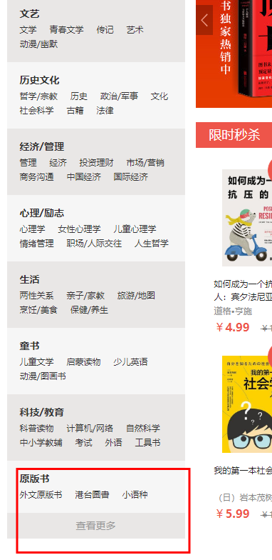
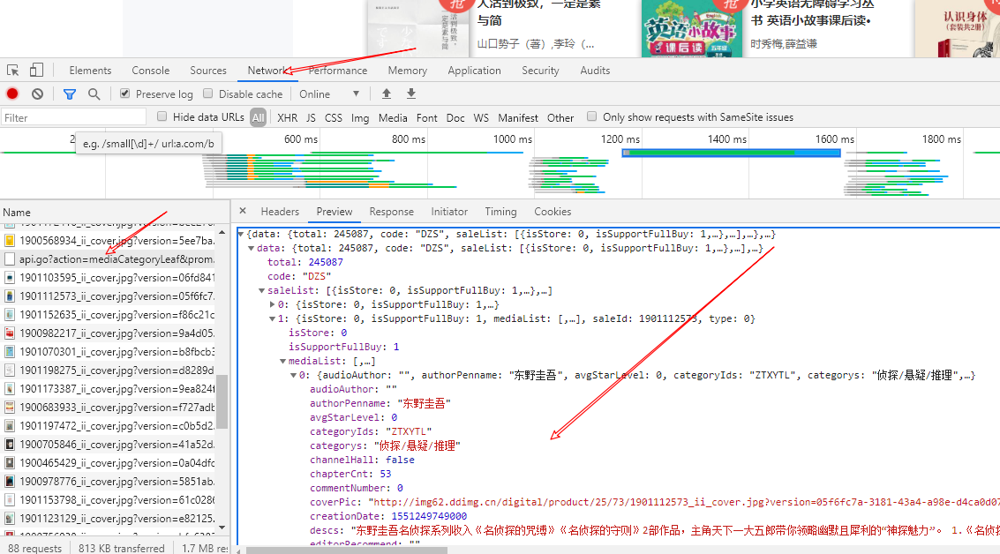
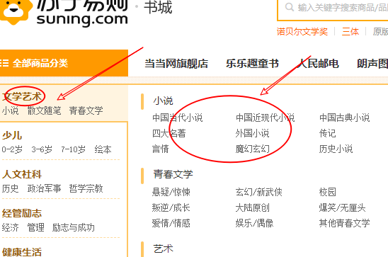
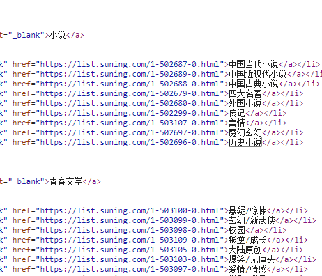
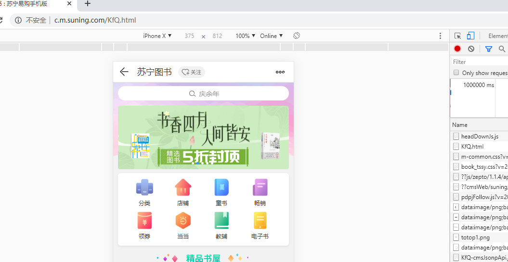
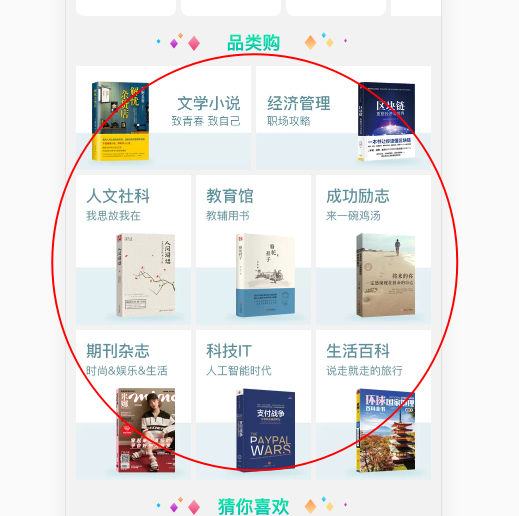
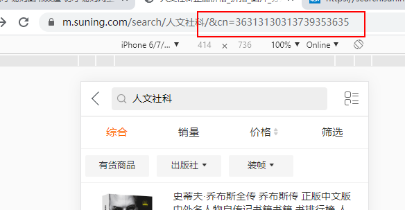

<!--
 * @Author: your name
 * @Date: 2020-03-28 15:37:10
 * @LastEditTime: 2020-04-05 15:58:29
 * @LastEditors: Please set LastEditors
 * @Description: In User Settings Edit
 * @FilePath: \python\book_project\md_book_project.md
 -->

# 项目确定

这是我的第一个项目，之前做过很多的小项目，这次项目目标是针对当当、苏宁易购、以及豆瓣读书三大网站进行图书数据的爬取到本地。

# 项目实施

确定好项目后，接下来要针对项目进行分析及实际的操作，由于此次的目标要针对三个网站数据的爬取，还是对图书信息的爬取，可想数据量之庞大，框架方面就使用scrapy，先搭建一个爬虫项目，等到后续优化为redis分布式，接下来分步骤进行。

1. 在项目中创建三个爬虫分别爬取当当、苏宁、豆瓣。
   * cd到项目文件夹下面，创建三个爬虫，为了方便后续优化，就创建继承类为scrapy.Spider的爬虫。
    > cd book_project\
    scrapy genspider -t basic dangdang_spider dangdang.com\
    scrapy genspider -t basic suning_spider suning.com\
    scrapy genspider -t basic douban_spider douban.com
    * 爬虫创建完成后，下面就是分别搭建dangdang_spider、douban_spider、suning_spider这三个爬虫。

2. 搭建dangdang_spider：
   * 在写当当这个爬虫之前，我们要先分析一波当当目前的网页情况。首先来看一下当当这个爬虫爬取的第一个URL，URL='<http://e.dangdang.com/>'，接下来我们使用本地浏览器请求一下这个URL，进去发现之后并没有我们想要的分类列表，通过网页分析可以得知还有跟多的分类，点击查看更多之后发现页面跳转URL='<http://e.dangdang.com/list-DZS-dd_sale-0-1.html>',在这个页面通过检查发现图书分类很全，而且每个分类下面有很多的小分类，那么该页面应该为当当爬虫的起始页面，获取该页面的各个分类的信息，通过各个分类再逐步提取分类下面的图书，这是整体的思路，后面通过页面分析发现，每个分类图书加载并不是通过response返回的，而是AJAX动态加载出来的，发现滑轮滚动到底端就会再加载一些图书，而URL地址并没有发生改变，此时我们需要进一步确认该网站是否采用了AJAX，验证方法也是比较容易，打开检查，反复加载图书，此时就会发现网页只是局部发生变化，而且在network里面可以找到当当网加载图书的接口，这样子就可以确定当当这个网站的图书是通过AJAX加载过来的，那么有两个思路，第一个思路可以通过selenium动态加载出来获取图书信息，但是，缺点是时间慢，而且消耗内存，不利于庞大的数据爬取，这里我们采取第二种方法，通过分析当当这个网站的接口进行数据提取，在上面提到通过反复加载，我们在network中已经找到了AJAX的接口，那么通过请求这些接口发现，返回的数据是json字符串，这样子，事情变得明朗了，我们只需要分析这些接口找出规律即可。
   * 现在我们开始分析接口，请求URL='<http://e.dangdang.com/list-DZS-dd_sale-0-1.html>'打开检查，在network中就会发现,通过反复请求刷新很容易就可以找到这个接口，还可以发现每个接口会多出二十一个图书数据，现在我们可以把方向放在接口上面，通过分析发现，这个接口请求的URL='<http://e.dangdang.com/media/api.go?action=mediaCategoryLeaf&promotionType=1&deviceSerialNo=html5&macAddr=html5&channelType=html5&permanentId=20200328115018345240051892155233779&returnType=json&channelId=70000&clientVersionNo=5.8.4&platformSource=DDDS-P&fromPlatform=106&deviceType=pconline&token=&start=84&end=104&category=DZS&dimension=dd_sale&order=0>'，针对这个接口可以优化出URL='<http://e.dangdang.com/media/api.go?action=mediaCategoryLeaf&start=105&end=125&category=DZS&dimension=dd_sale>'，接着构造这个URL中的start、end、category参数，就可以请求当当网站的图书，返回的是一个json字符串，start和end是请求图书的顺序，分析发现，返回的数据最多101个，在数据没有的时候会在另一个字典中打印“亲，这次真的没有了”，而另外一个参数category是图书的分类，那么这里的分类就要到我们开始的URL里面提取，下面撸代码请求数据。
   * 代码部分：

   ```python
    class DangdangSpiderSpider(scrapy.Spider):
        name = 'dangdang_spider'
        allowed_domains = ['dangdang.com']
        start_urls = ['http://e.dangdang.com/list-DZS-dd_sale-0-1.html']
        url = 'http://e.dangdang.com/media/api.go?action=mediaCategoryLeaf&start={}&end={}&category={}&dimension=dd_sale'

        def parse(self, response):
            # 对返回的response进行数据提取
            item_list = response.xpath("//ul/a/li")
            for i in item_list:
                item = {}
                item['data_type'] = i.xpath('./@data-type').get()
                item['dd_name'] = i.xpath('./@dd_name').get()
                url = self.url.format(0, 20, item['data_type'])
                # 先请求前20个数据
                yield scrapy.Request(url, callback=self.parse_item)
                # 要爬取全站图书就把break注释掉
                break

        def parse_item(self, response):
            # 提取数据
            dangdnag_spideritem = dangdang_spiderItem()
            responses = json.loads(response.text)
            # total = responses['data']['total'] 该行为获取每个小分类图书的总量
            saleList = responses['data']['saleList']
            for book in saleList:
                # 遍历每一本书提取信息
                dangdnag_spideritem['title'] = book['mediaList'][0]['title']
                dangdnag_spideritem['authorpenname'] = book['mediaList'][0]['authorPenname']
                dangdnag_spideritem['price'] = book['mediaList'][0]['price'] * 0.01
                dangdnag_spideritem['categorys'] = book['mediaList'][0]['categorys']
                yield dangdnag_spideritem
            if responses['status']['code'] == 0:
                # 处理下一页数据
                for i in range(21, responses['data']['total'], 20):
                    url = self.url.format(i, i+19, responses['data']['code'])
                    yield scrapy.Request(url, callback=self.parse_item)

   ```

   这是爬虫部分的代码，因为是接口所以要对“下一页”做处理，这里我学艺不精，只是简单的做了一个方法对返回的数据做了判断，当然这只是最初版本，还会继续优化。

3. 搭建douban_spider：
    * 对豆瓣读书网站的分析，起始URL='<https://book.douban.com/tag/>',这个URL地址有豆瓣所有图书的分类方便我们程序员撸代码，针对起始URL进行数据提取并解析下一级链接请求，我们的最终目的是把豆瓣读书的图书名称、作者以及价格等，豆瓣图书这个网站并没有采用AJAX技术，这样网页链接分析相对容易，不过在反爬上面比较明显，要做好伪装，在没有搭建分布式之前这个爬虫整体的思路还是，对起始URL请求，获取每个分类链接，交给调度器，分别对每个分类进行爬取，下面还是直接撸代码。
    * 代码部分：

    ```python
    class DoubanSpiderSpider(scrapy.Spider):
        name = 'douban_spider'
        allowed_domains = ['book.douban.com']
        start_urls = ['https://book.douban.com/tag/']

        def parse(self, response):
            # 获取分类链接
            book_tags = response.xpath(
                "//div[@id='content']//b/../a/@href").extract()
            for book in book_tags:
                # print(response.urljoin(book))
                yield scrapy.Request(response.urljoin(book),
                                    callback=self.parse_item)
                # 要爬取全站图书就把break注释掉
                break

        def parse_item(self, response):
            douban_spideritem = douban_spiderItem()
            items = response.xpath('//div[@id="content"]')[0]
            book_tag = items.xpath('.//h1/text()').get()
            li_list = items.xpath('//div[@id="subject_list"]/ul//li')
            for li in li_list:
                # 循环一个页面书籍列表
                douban_spideritem['title'] = li.xpath('.//h2/a/text()').get()
                douban_spideritem['author_price'] = li.xpath('.//div[@class="pub"]/text()').get()
                douban_spideritem['book_tag'] = book_tag
                # 把每本书信息塞到管道进行处理
                yield douban_spideritem
            # 处理下一页链接
            next_href = response.xpath('//span[@class="next"]/a/@href')
            if len(next_href) > 0:
                # 还有下一页
                next_href = next_href.get()
                yield scrapy.Request(response.urljoin(next_href),
                                    callback=self.parse_item)

    ```

    这是豆瓣代码部分，代码思路还是一样的，提取信息等还是一样的，无非在管道那边做的设置不一样，在后面会介绍管道部分。

4. 搭建suning_spider：
    * 苏宁这个爬虫的话还是第一次爬，先来分析一下URL，首先确定目标，爬取苏宁图书的每本数据部分信息，这里苏宁的起始URL='<https://book.suning.com/>'，使用浏览器请求这个URL进行检查分析，现在我们的思路是找分类列表，只有找到分类列表，才可以根据范围大规模的爬取，我们找到这个网页的分类列表,你会发现在分类列表下还会跳出小分类列表，此时就要思考这个小分类列表是否是后期加载上去的，当然也有可能是根据一些技术获取到本地后浏览器自动生成的，验证想法，打开浏览器检查查看network，重新请求URL把鼠标移到分类列表上看是否会有请求链接，然而并没有，那么就查看此页面源代码，也就是返回的response，你会发现这个,小分类链接是有的这样子我们可以根据小分类链接去提取每个分类的图书，请求一个分类，但是后面又来新的问题，图书信息是AJAX上去的那么要去寻找接口，接口是比较容易分析的，这个苏宁网页版还是有点难度的，它的这个接口有些数据都是JS加密上去的，这样子的相对于目前的我来说有点费时，后续我会把JS解密这块给更新到代码上，目前的话，我们就转移方向，针对苏宁手机版页面进行数据提取，把chrome切到手机模式起始URL='<http://c.m.suning.com/KfQ.html>'，请求页面，还是常规思路找到分类列表进行数据请求分析，分析发现起始URL的信息是AJAX，这样子的话就要找借口请求数据获取起始页有用的数据，接口URL='<http://lib.suning.com/api/jsonp/cb/KfQ-cmsJsonpApi.jsonp>'，通过这个获取起始页信息，这里找到分类列表但是在我反复请求发现有用的分类链接只有前面两个是正常的后面两个好像设置反爬机制了，看图，URL后面发生了变化，也正是发生了变化导致网页请求进去后图书不会加载更多，不过可以用前两个分类构造后面分类的URL即可，这样子所有分类的URL就获取到了，获取到分类URL后分别进行数据爬取，这是大的方向，但是并没有这么简单，当进行每个分类图书爬取是会发现，图书的数据是动态加载出来的，既然这样我们就要分析接口，进行接口式请求爬取，接口URL＝'<https://search.suning.com/emall/mobile/wap/clientSearch.jsonp?cityId=025&keyword=%E5%B0%8F%E8%AF%B4&channel=99999972&cp=1&ps=10&st=0&set=5&cf=&iv=-1&ci=&ct=-1&channelId=WAP&sp=&sg=&sc=&prune=&operate=0&isAnalysised=0&istongma=1&jlfstoreCode=null&jlfOnly=0&jlftownCode=null&saleMode=null&v=99999999&sesab=ABB0A&jzq=13034&callback=success_jsonpCallback>'，看似很长，在经过优化后留下必要的URL参数可以获得URL='<https://search.suning.com/emall/mobile/wap/clientSearch.jsonp?keyword=%E5%B0%8F%E8%AF%B4&channel=99999972&cp=0&ps=10&set=5&ct=-1&v=99999999>'，这个接口在每个分类下都是通用的，只不过参数要变一下，请求每个分类要改变几个参数，KEYWORD这个参数就是分类的名字，请求哪一个分类就把分类请求的URL上面的关键字部分带上，这个可以从起始URL获取，后边的CP是请求的页面，PS为每页返回十本书数据，至于后面的参数我也不懂，搞懂前面几个就可以，综上总体的思路就出来了根据起始URL获取每个分类在代码中的名称通过接口URL构造链接，请求获取图书信息，在“下一页”处理方面，通过反复请求API就会发现规律，进行判断即可。那么下面撸代码！！！
    * 代码部分：

    ```python
    class SuningSpiderSpider(scrapy.Spider):
        name = 'suning_spider'
        allowed_domains = ['suning.com']
        start_urls = ['http://lib.suning.com/api/jsonp/cb/KfQ-cmsJsonpApi.jsonp']
        url = 'https://search.suning.com/emall/mobile/wap/clientSearch.jsonp?keyword={}&channel=99999972&cp={}&ps=10&set=5&ct=-1&v=99999999'
        tag_name = ''

        def parse(self, response):
            # 对类别名称进行提取
            pattern = re.compile(r'\(.*\)')
            response_item = pattern.findall(response.body_as_unicode())
            # 使用正则提取网页中的数据，对数据进行预处理
            response_eval = eval(response_item[0])
            # 处理后的数据为list
            # 获取分类信息的字典
            for d in response_eval:
                if d.__contains__('fl8p_bt'):
                    response_dict_list = d['fl8p_bt']['nodes'][0]['tag']
                    for url_dict in response_dict_list:
                        url_name = url_dict['linkUrl']
                        pattern = re.compile(r'https://m\.suning\.com/search/(.*?)/&')
                        global tag_name
                        self.tag_name = pattern.findall(url_name)[0]
                        # 已经获取到URL的类别名称，开始构造URL
                        # 构造一个一页十个的URL
                        stat_url = self.url.format(self.tag_name, 0)
                        # 返回到下一页函数进行数据提取
                        yield scrapy.Request(stat_url, callback=self.parse_item)
                        # 要爬取全站图书就把break注释掉
                        break

        def parse_item(self, response):
            response_json = json.loads(response.text)
            # 进行判断是否有返回数据
            if len(response_json['errorCode']) == 0:
                # 进行数据提取及下一页请求
                suning_spideritem = suning_spiderItem()
                book_list = response_json['goods']
                for book in book_list:
                    # 对每本书的数据进行提取
                    suning_spideritem['catentdesc'] = book['catentdesc']
                    suning_spideritem['author'] = book['author'] if len(book['author']) > 0 else None
                    suning_spideritem['price'] = book['price']
                    suning_spideritem['tag_type'] = self.tag_name
                    yield suning_spideritem
                '''
                构造下一页URL，构造一个生成器,
                这的601是根据分析页面获得的结果，这里可以随便设定，
                尽量大一点要比六百大，因为苏宁这个网站最多返回六千个数据
                '''
                for x in range(1, 601):
                    next_url = self.url.format(self.tag_name, x)
                    yield scrapy.Request(next_url, callback=self.parse_item)
            else:
                pass

    ```

    这个苏宁爬虫还是有点难度的，后期我会更新代码针对网页版有一个爬取，苏宁这个网站无论在网页端还是手机端都是最多只返回六千的数据，反爬机制还是做的很全的，包括在爬取的时候返回时间也是个问题，这些问题在后续更新中都会处理掉。

5. 管道、以及item：
    * 我在管道内做了数据的简单处理及存储下面是代码部分；

    ```python
    class BookProjectPipeline(object):
        def process_item(self, item, spider):
            return item


    class suning_spiderPipeline(object):
        """
        对豆瓣爬虫进行数据处理
        """
        def open_spider(self, spider):
            self.client = pymongo.MongoClient(
                host=spider.settings.get('MONGO_HOST'),
                port=spider.settings.get('MONGO_PORT'),
            )
            # 数据库登录需要帐号密码的话
            # self.client.admin.authenticate(
            #     settings['MINGO_USER'], 
            #     settings['MONGO_PSW']
            #     )
            self.db = self.client[spider.settings.get('MONGO_DB')]  # 获得数据库的句柄
            self.coll = self.db['suning_spider_book']  # 获得collection的句柄

        def process_item(self, item, spider):
            """
            进行判断，如果进来的item是豆瓣的数据就进行数据处理存储，
            不然就跳过数据
            """
            if spider.name == 'suning_spider' and isinstance(item, suning_spiderItem):
                # 把进来的item数据进行清洗处理
                book = {}
                book['title'] = item['catentdesc']
                book['author'] = item['author']
                book['price'] = item['price']
                book['type'] = item['tag_type']
                self.coll.insert(book)  # 向数据库插入一条记录,要插入字典
                # print(item)
            return item


    class douban_spiderPipeline(object):
        """
        对豆瓣爬虫进行数据处理
        """
        def open_spider(self, spider):
            self.client = pymongo.MongoClient(
                host=spider.settings.get('MONGO_HOST'),
                port=spider.settings.get('MONGO_PORT'),
            )
            # 数据库登录需要帐号密码的话
            # self.client.admin.authenticate(
            #     settings['MINGO_USER'], 
            #     settings['MONGO_PSW']
            #     )
            self.db = self.client[spider.settings.get('MONGO_DB')]  # 获得数据库的句柄
            # 获得collection的句柄
            # self.coll = self.db[spider.settings.get('MONGO_COLL')]  
            self.coll = self.db['douban_spider_book']

        def process_item(self, item, spider):
            """
            进行判断，如果进来的item是豆瓣的数据就进行数据处理存储，
            不然就跳过数据
            """
            if spider.name == 'douban_spider' and isinstance(item, douban_spiderItem):
                # 把进来的item数据进行清洗处理
                book = {}
                book['title'] = item['title'].split()[0]
                # 这个地方还要做一下处理
                pattern = re.compile(r'（.）|\[.\]|\(.\)')
                author_price = [x.split() for x in item['author_price'].split("/")]
                author = author_price[0]
                if len(author) > 0:
                    if len(pattern.findall(author[0])) > 0:
                        if author[0] == pattern.findall(author[0])[0]:
                            author = author[0] + author[1]
                    else:
                        author = author[0]
                else:
                    author = ''
                book['author'] = author
                book['price'] = author_price[-1][0]
                book['tag'] = item['book_tag'].split(":")[1]
                self.coll.insert(book)  # 向数据库插入一条记录,要插入字典
                # print(item)
            return item


    class dangdnag_spiderPipeline(object):
        """
        对当当爬虫进行数据处理
        """
        def open_spider(self, spider):
            db = spider.settings.get('MYSQL_DB_NAME')
            host = spider.settings.get('MYSQL_HOST')
            port = spider.settings.get('MYSQL_PORT')
            user = spider.settings.get('MYSQL_USER')
            passwd = spider.settings.get('MYSQL_PASSWORD')

            self.db_conn = pymysql.connect(
                host=host,
                port=port,
                db=db,
                user=user,
                passwd=passwd,
                charset='utf8',
                )
            self.db_cur = self.db_conn.cursor()

        # 关闭数据库

        def process_item(self, item, spider):
            # 对spider，item进行判断
            if spider.name == 'dangdang_spider' and isinstance(item, dangdang_spiderItem):
                self.insert_db(item)
            return item

        # 插入数据
        def insert_db(self, item):
            values = (
                item['title'],
                item['authorpenname'],
                item['price'],
                item['categorys'],
            )
            sql = 'INSERT INTO dangdang_books(title,authorpenname,price,categorys) VALUES(%s,%s,%s,%s)'
            self.db_cur.execute(sql, values)

        def close_spider(self, spider):
            self.db_conn.commit()
            self.db_conn.close()

    ```

    这里设置了三个管道，负责对每个爬虫数据进行处理，设置三个管道是为了后续方便对整个项目改进，毕竟项目还没有完成，这只是初建。

    * item部分；

    ```python
    class BookProjectItem(scrapy.Item):
        # define the fields for your item here like:
        # name = scrapy.Field()
        pass


    class dangdang_spiderItem(scrapy.Item):
        # define the fields for your item here like:
        # name = scrapy.Field()
        title = scrapy.Field()
        authorpenname = scrapy.Field()
        price = scrapy.Field()
        categorys = scrapy.Field()


    class douban_spiderItem(scrapy.Item):
        # define the fields for your item here like:
        # name = scrapy.Field()
        title = scrapy.Field()
        author_price = scrapy.Field()
        book_tag = scrapy.Field()


    class suning_spiderItem(scrapy.Item):
        # define the fields for your item here like:
        # name = scrapy.Field()
        catentdesc = scrapy.Field()
        author = scrapy.Field()
        price = scrapy.Field()
        tag_type = scrapy.Field()

    ```

    Item 部分的代码也是每个爬虫分别一个Item以保证后续代码开发时方便更改数据。
    项目实施这块基本就这些。

# 项目总结

终于到最后了，book项目1.0有一个落幕了，这几天的劳神费脑也算是有一个好结果了，整体感觉这个项目流程已搭建完毕，后续还要做细节上的开发，包括数据具体的分析处理，还有爬取速度改进方面，具体可以使用分布式来去部署这个项目，到时还要改进爬虫细节，目前的话三个爬虫感觉写的最顺的时豆瓣的，毕竟之前拿豆瓣来来回回爬了不知多少遍了，对于苏宁的爬虫还需要努力攻克，学识不深，后续努力，总结至此。
